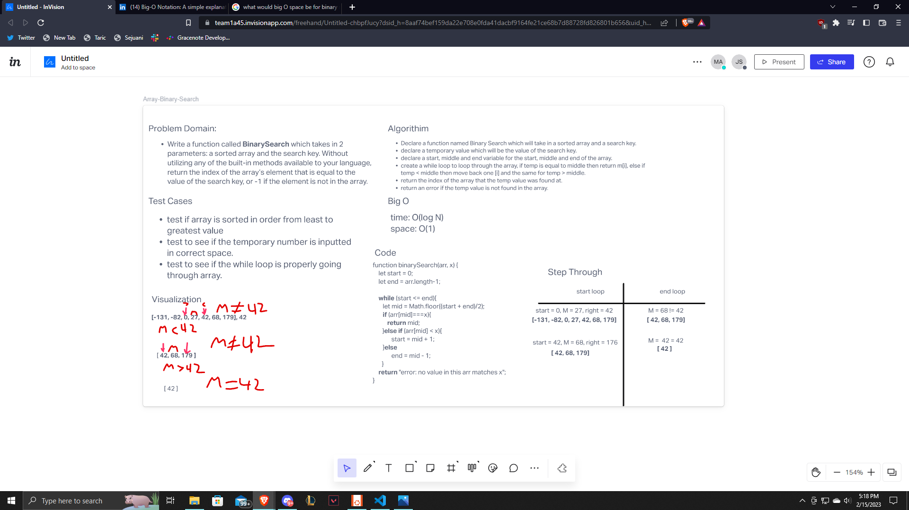

# Binary Search of Sorted Array

Write a function called BinarySearch which takes in 2 parameters: a sorted array and the search key. Without utilizing any of the built-in methods available to your language, return the index of the array’s element that is equal to the value of the search key, or -1 if the element is not in the array.

## Whiteboard Process

## Approach & Efficiency

 First we read through the problem domain to figure out what we needed to do for the code challenge. Next, we went through our test cases to figure out what we needed to make sure would be there. We then created out visualization and talked about the steps needed. After this I wrote the algorithm as he typed the code and we talked about each part needed to be incorporated for this binary search to work. Afet that it was just the big O and creating the step through. I felt this code challenge went quite well and it got done in the estimated time of 45 mins.