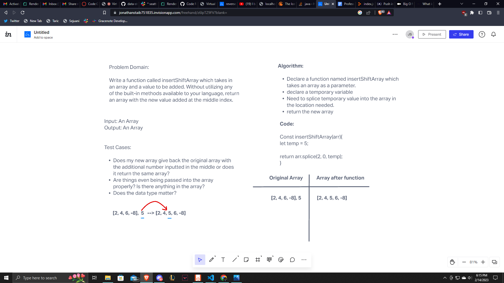

# Insert to Middle of an Array

Write a function called insertShiftArray which takes in an array and a value to be added. Without utilizing any of the built-in methods available to your language, return an array with the new value added at the middle index.

## Whiteboard Process

## Approach & Efficiency

I started off with the problem domain to get an understanding of what I had to do. I got the input and output from the problem domian provided to us by the canvas assignment. I thought of what may need to be tested and put some proper testing that should be implemented. I then went to draw the diagram as to get a better understanding of what needs to be done as seeing it can help very much as a reference if you get stuck. Then it came to the alogrithm and code, which when seeing the visualization splice was the thing that came into my mind. I decided to go with splice when trying to put a value into an array with a specific destination.