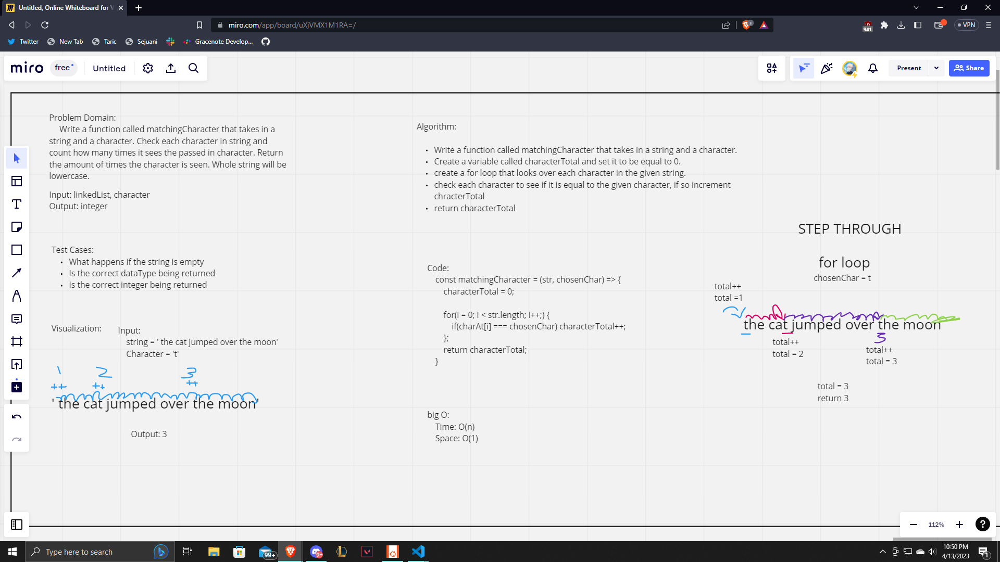

# Solo Interview 44 Matching Characters

  Today I thought of what would be a fun interview question to work on and could also get my mind working. I wanted to work on something that took in 2 values but couldn't think of anything with a data structure so I came up with this. I started off with creating the problem domain and writing the input and outputs based on the problem domain. From here I created test cases where I felt my code could break. I then created a visualization for what my problem would look like. Moving onto the algorithm I created an algorithm that would make the code work. I read off the algorithm and created code accordingly. From here I analyzed the big O notation and stepped through my solution.

