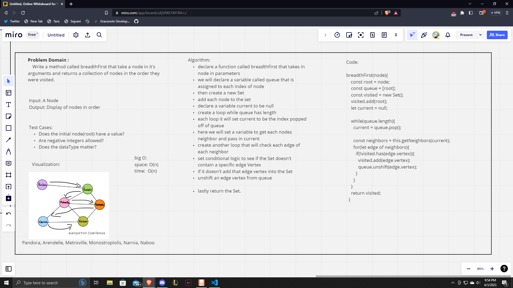

# Graphs

Implement your own Graph. The graph should be represented as an adjacency list, and should include the following methods: add node, add edge, get nodes, get neighbors and size.

## Challenge

We needed to implement our own Graph with many different methods. We followed along a bit differently in class so we created the methods: addVertex, addDirectedEdge, getNEightbors, getNodes, breadthFirst, depthFirst and size. No testing required per Ryan but add in tests if you would like.

## Approach & Efficiency

The approach that we took as a class was to first create our Graph class with Vertex and Edge classes as well. From here we made our methods to utilize this Graph. We added in addVertex, addDirectedEdge, getNEightbors, getNodes, breadthFirst, depthFirst and size methods. From here we tested with console logging and running node index.js within our graph folder.

Reference: Ryan Gallaway Lecture

## BreadthFirst Whiteboard

