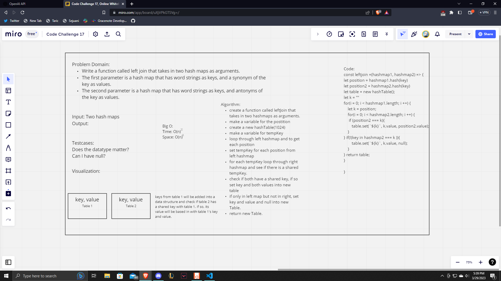

# Left Join

Write a function called left join that takes in two hash maps as arguments. The first parameter is a hash map that has word strings as keys, and a synonym of the key as values. The second parameter is a hash map that has word strings as keys, and antonyms of the key as values.

## Challenge

Write a function called left join that takes in two hash maps as arguments. The first parameter is a hash map that has word strings as keys, and a synonym of the key as values. The second parameter is a hash map that has word strings as keys, and antonyms of the key as values. Combine the key and corresponding values, if they exist, into a new data structure according to LEFT JOIN logic. LEFT JOIN means all the values in the first hashmap are returned, and if values exist in the right hashmap, they are appended to the result row. If no values exist in the right hashmap, then some flavor of NULL should be appended to the result row.

## Approach & Efficiency

The approach that we took was to firstly create a whiteboard to write out problem domain, test cases, visualization, algorithm etc. Once we got a little bit of an understanding of how things would need to be written we wrote out an algorithm and attempted to create code based on said algorithm. We didn't get a chance to step through or test out our code but I feel that we did a good job and the code is close to what it needs to be.

## API

We created a leftJoin function that takes in two hash maps. It will loop through the left map and check if the right map has a corresponding key. If it does, that key and both maps values will be pushed into a new hashTable. If there is a key in the left map that doesn't have a matching key in the right then it will return the key, the left maps value and null. Finally it will return the hashTable.

