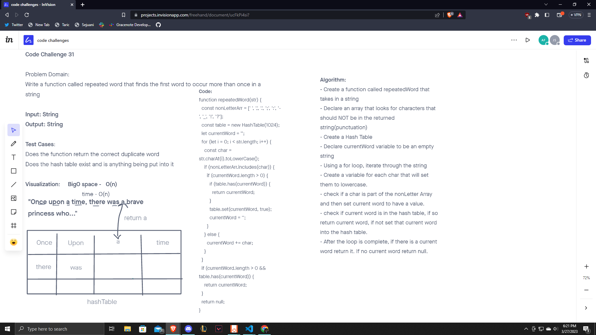

# Repeated Word

Write a function called repeated word that finds the first word to occur more than once in a string.

## Challenge

We first need to whiteboard and then We needed to create a repeatedWord function using a hashtable. We need to check if the current word has already been set into the hashtable, if not then set the current word into the hashTable. If the word repeats, return the word. If not, return null.

## Approach & Efficiency

The approach that we took was to firstly create a whiteboard to write out problem domain, test cases, visualization, algorithm etc. Once we got a little bit of an understanding of how things would need to be written we wrote out an algorithm and attempted to create code based on said algorithm. We stepped through the solution but kind of combined it with the visualization a bit.

## API

We created a repeatedWord function that takes in a string. It checks each character and sets them to lowercase, if the character was in the nonLetter array which includes a space then it will create a currentWord. This currentWord will then check if there is that currentWords value already in the hastable, if not then it will set that currentWord value into the hashTable. If there is one already, it will return the currentWord value because that is a repeated word. If at the end of the loop there is no repeatedWord, return null.

