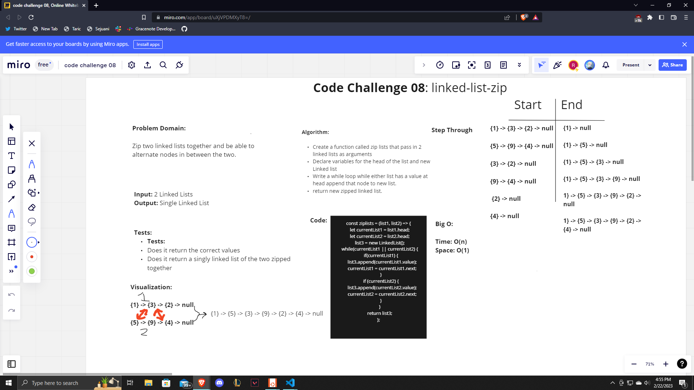

# Linked List KTH

Zip two linked lists together and be able to alternate nodes in between the two.

## Challenge

We needed to create a function that would zip together two linked lists and create a whiteboard for it.

## Approach & Efficiency

The approach that we took as a class was to first create our whiteboard with our algorithm, code, visualization, problem domain, etc. Then we moved on to putting the code from our whiteboard into our code itself. The big O for both time is O(n) and space is O(1).

