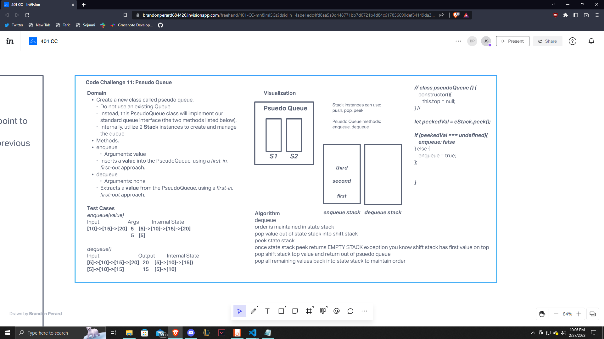

# PSeudo Stack Queue

Create a class called PseudoQueue that does not use an existing queue, instead it will only implement enqueue and dequeue.

## Challenge

We firs need to whiteboard and then We needed to create a PseudoQueue class that will take construct two seperate stacks. The enqueue function will take in a value into the pseudoQueue and push a new value in and pop the oldest value out. The queue won't take any value in and it will use the same first in first out attitude to remove a value.

## Approach & Efficiency

The approach that I took was to firstly create a whiteboard to write out problem domain, test cases, visualization, algorithm etc. Once we got a little bit of an understanding of how things would need to be written I wrote out an algorithm and attempted to create code based on said algorithm. The code didn't necesarilly work properly so I referred to Ryan's code challenge review approach at the problem and changed my code accordingly. From there I wasn't exactly sure how to make tests for this function. I struggle a bit with making tests at times and wasn't able to get that completed.

## API

The methods that I created for my pseudoQueue today were enqueue and dequeue, they both check the pseudoStack to see what needs to be done. Based on what the code will see in the stack it will execute accordingly. Lots of conditional logic within the code :)

## Resources

Ryan Gallaway code review for cc 11 :)

