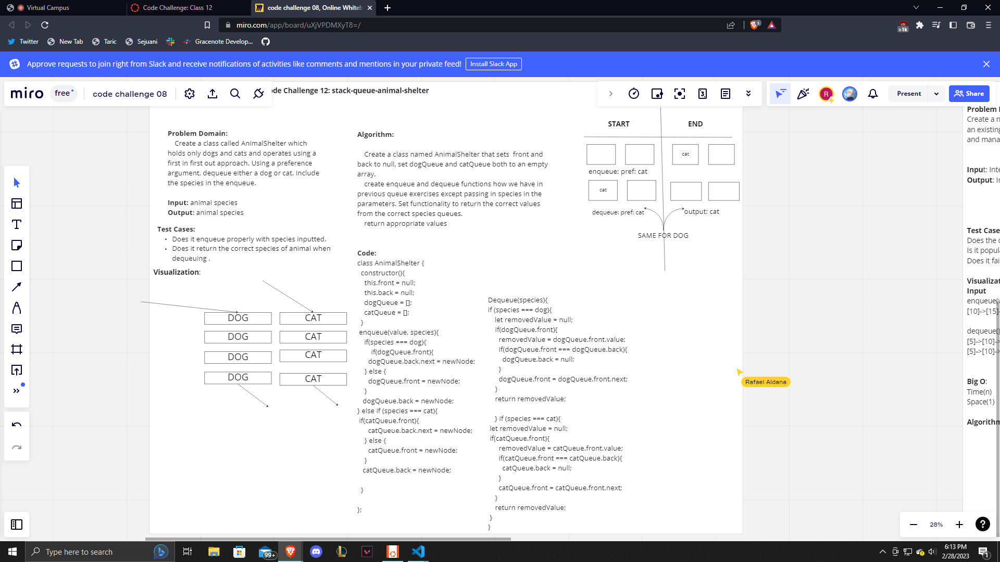

# Stack and Queue Animal Shelter

Create a class called AnimalShelter which holds only dogs and cats and operates using a first in first out approach. Using a preference argument, dequeue either a dog or cat. Include the species in the enqueue.

## Challenge

We firs need to whiteboard and then We needed to create a Animal Shelter class that has to queues utilizing enqueue and dequeue based on a species inputted. We then need to try the code and run tests to make sure it is passing properly.

## Approach & Efficiency

The approach that I took was to firstly create a whiteboard to write out problem domain, test cases, visualization, algorithm etc. Once we got a little bit of an understanding of how things would need to be written I wrote out an algorithm and attempted to create code based on said algorithm. Changed the code accordingly and updated the algorithm to the code being changed, this happened many times because we had many ideas on how this code should come out.

## API

The methods that I created for my Animal Shelter today were enqueue and dequeue, they both have if and else if statements within them to determine which species queue they need to be adding into and removing from. If the inputted species is dog then it should go through the dog queue for either functionality.

