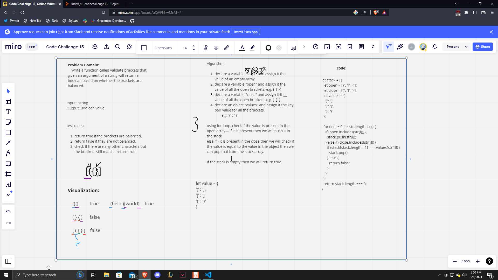

# Stack and Queue Animal Shelter

Write a function called validate brackets that given an argument of a string will return a boolean based on whether the brackets are balanced or not.

## Challenge

We first need to whiteboard and then We needed to create a validateBrackets function that has to take in a str and determine if the brackets in the str are balanced or not. We then need to try the code and run tests to make sure it is passing properly.

## Approach & Efficiency

The approach that we took was to firstly create a whiteboard to write out problem domain, test cases, visualization, algorithm etc. Once we got a little bit of an understanding of how things would need to be written Ash wrote out an algorithm and we created code based on said algorithm. She talked her way through teh algorithm because I was a bit confused on her thought process but I understood it in the end and it was perfect. We then went into replit and wrote the code out with some trial and error and some linter errors but the console logs to test it were working perfectly there. I then implemented the code into my vscode and created tests to make sure the code was correct and it worked great. Big thank you to Ash today, she was a great help when it came to my understanding of the code challenge and was a great partner `:)`;

## API

The methods that we created for my validatebrackets today were just validate brackets. It creates variables for open and close brackets and compares the two of them inside a for loop with if conditions.

