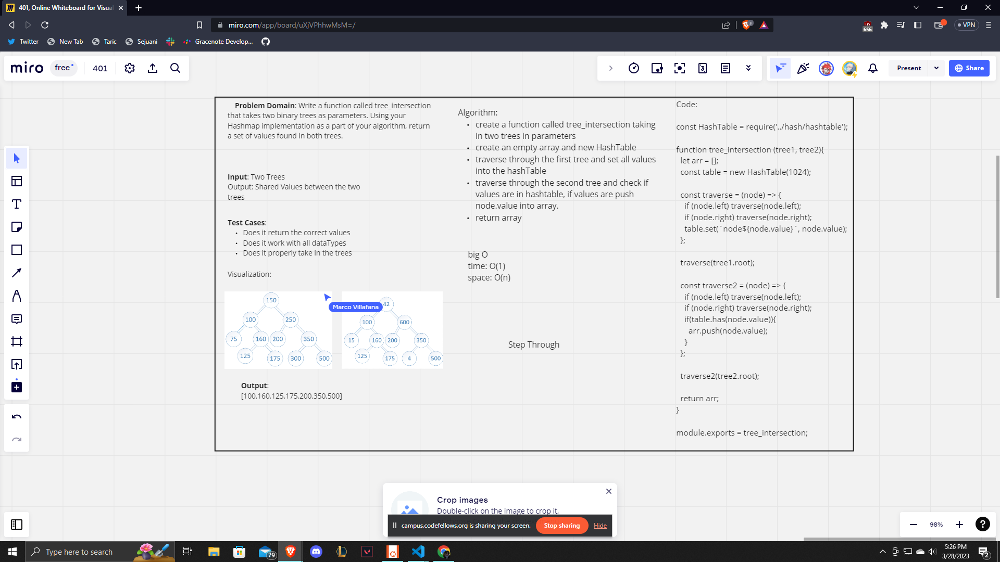

# Tree_Intersection

Write a function called tree_intersection that takes two binary trees as parameters. Using your Hashmap implementation as a part of your algorithm, return a set of values found in both trees.

## Challenge

Write a function called tree_intersection that takes two binary trees as parameters. Using your Hashmap implementation as a part of your algorithm, return a set of values found in both trees. You will have to utilize Trees which we made in the past for your testing as well as the hashtables we made on Friday.

## Approach & Efficiency

We started off with talking about what we would need to do for this assignment, we figured out quite quickly how our code would need to look. Kind of just talked through the algorithm. From here we started our whiteboard with the problem domain, input/ output, test cases, and visualization. From here we created our algorithm very quickly as we already knew what had to be done. We created code and then we had time over so we created tests for this code. We had a weird bug saying that keys.split within hashTables was not a function so we weren't able to finish this out.

## API

We have a method that checks if two trees share the same value within any of their nodes. This is done using our Trees that we created in the past, the HashTables we created in the past using their set and has functions.

