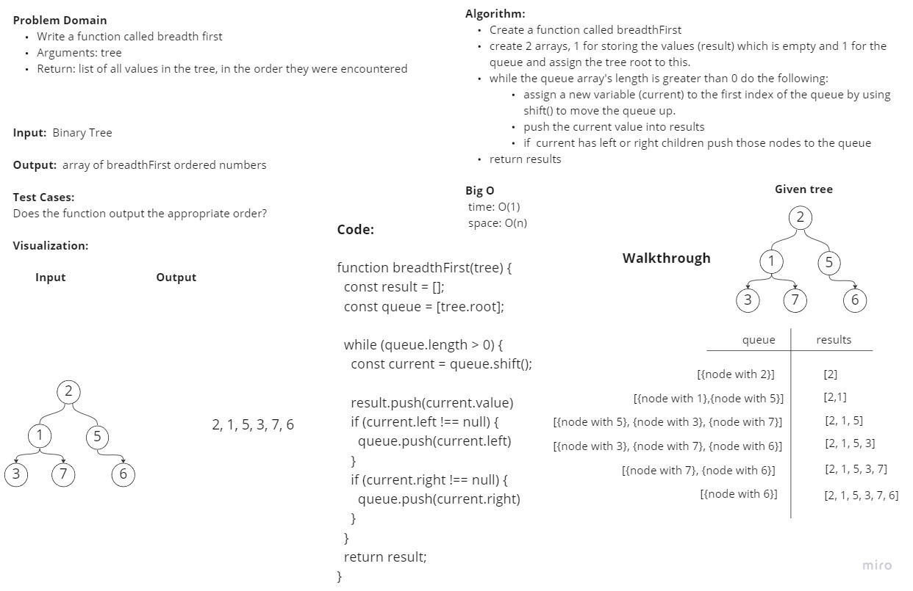

# BreadthFirst

A tree is a node class with a root, left and right values. The tree works its way down the left side until it can no longer find a left, when it does this it will look right and if there is no right it will go back up and repeat this process. This is just the path that is used to traverse a tree. Trees are used in many places such as file structure and DOM, maybe even canvas assignments too? BreadthFirst is a way to go through the tree and put all node values into an array in order that you go through the tree.

## Challenge

Create a method that goes through a tree and plugs each node value into a tree for every node it finds in correct order.

## Approach & Efficiency

We first created a whiteboard with all necessary parts included. We then worked on the algorithm and wrote code to make breadth first work the way it should. We then put our code into our vscode and created tests to make sure they worked.

## API

I have created a method for breadthFirst that should go through a tree and plug each value into an array as it traverses the tree.

