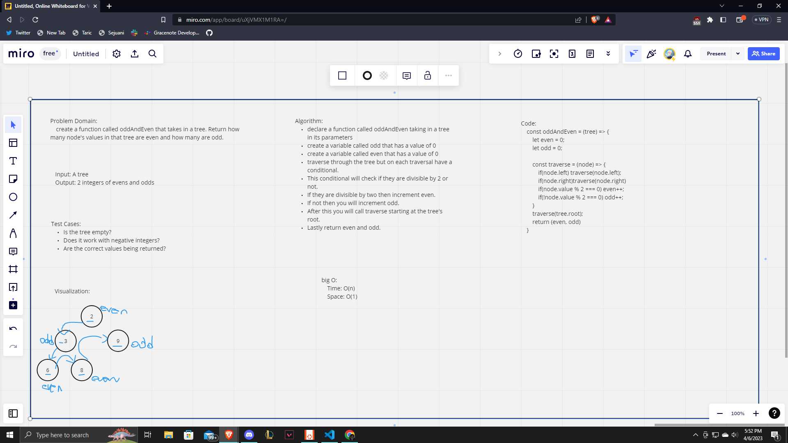

# Class 39 Solo Interview

I was looking on Geeks for Geeks DSA and saw a tree challenge to find the size of the tree. I thought it would be more interesting to calculate the number of even and odd nuumber values within a tree. This was my solo interview so I timed myself 30 mins and here was what I got done. I talked through the code in my head as though it was an interview process.

 