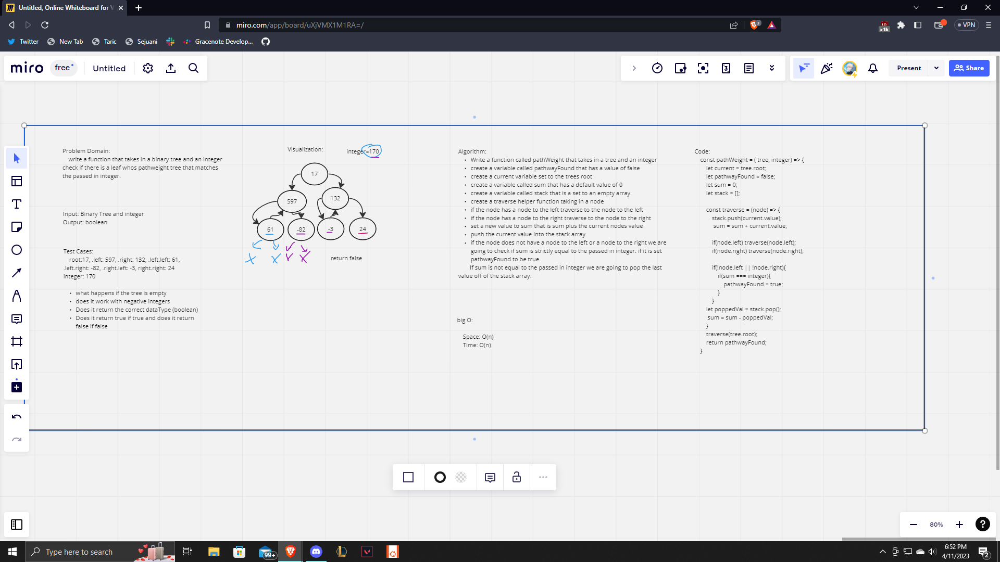

# Code Challenge 42

  I asked Ryan if it would be okay for me to finish my interview final questions as todays code challenge. I was doing quite well I feel but got stuck on one part that was really bothering me and didn't have enough time to finish the rest of it.

## Challenge

 Write a function that takes in a binary tree and an integer. Check if there is a leaf in the tree whos pathweight matches the passed in integer.

## Approach & Efficiency

I first went through the problem out loud stepping through it and talking about what I had in mind for my approach. I did this incase of checking if there was anything unknown that I could clarify. I asked clarifying questions about the problem domain. Next was the input Output, I put them in and talked about how they would work and asked him how we felt about it. Next was test cases, I asked for an example and talked about some scenarios where the code coudl break. We went through what I believed was all. Next was the visualization which was where I realized I had a misunderstanding of what was being asked in the problem domain. Here I learned more about pathweight and was able to understand what needed to be done in the task. I then went on to the algorithm where I got stuck for a little. I got in a lot of lines where it was looking very good but then started realizing little things(so this could happen or we're not accounting for this, etc.) This took quite a bit of time out but I got through it. I then flew through the code, great syntax and idomatically correct, I was very confident, until I ran into that same problem of how to pop off a node that has child nodes but they have all been checked. Then I ran out of time for the big O and step through and was very upset because I felt so confident throughout it all.

## API

I have created a method for pathWeight that takes in a tree and an integer. It will return a boolean based on whether a leaf's pathweight is equal to the passed in integer.

