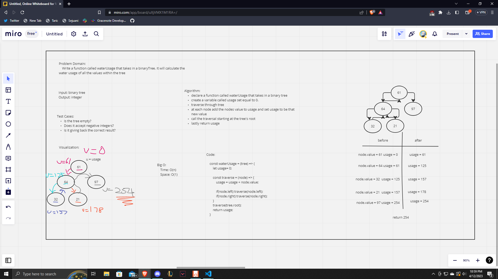

# Class 43 Solo Interview (Sprinklers)

I was having a tough time with the lab so I opened up interview #1, I did this by myself so I read through the doc instead of asking the questions about what is needed. I didn't look at pseudo code or anything of the sort until after though. I feel I did well on this lab as I love working on trees. I feel very comfortable with them and love seeing tree problems. I started with filling out the problem domain, input/output and then determined what some test cases may be to see what may break the code. From here I created a visualization to grasp a better understanding of the problem domain. Next I created an algorithm and wrote code based off this said algorithm. I learned from my whiteboard interview to pay more attention to where things are happening compared to my traversal and am ready for another mock interview final... if it is a tree one. Finally I analyzed the big O and stepped through the code.

